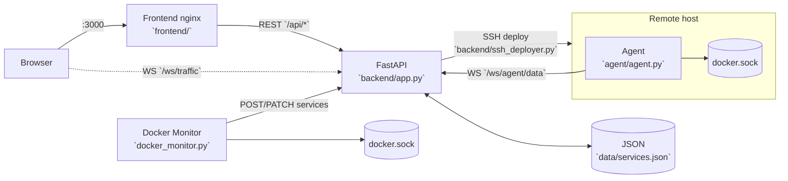

# Copilot instructions (kuNNA)

## Architecture diagram

## Big picture
- Docker-first dashboard: static `frontend/` (nginx) + FastAPI API in `backend/app.py` + Docker auto-discovery in `docker_monitor.py`.
- Persistent state is a JSON “DB”: `data/services.json` mounted into the backend as `/app/data/services.json` (see `DATA_FILE` in `backend/app.py`).

## Run / dev workflow (preferred)
- Start everything: `docker-compose up -d` (frontend `:3000`, backend `:8000`).
- Logs: `docker-compose logs -f backend` / `frontend` / `docker-monitor`.
- Hot reload caveat: only `backend/app.py` is bind-mounted (see `docker-compose.yml`). If you change `backend/agent_manager.py` or `backend/ssh_deployer.py`, rebuild: `docker-compose up -d --build backend`.
- `docker-monitor` bakes in `docker_monitor.py`; after edits rebuild: `docker-compose up -d --build docker-monitor`.
- Frontend HTML is bind-mounted read-only (`./frontend:/usr/share/nginx/html:ro`); refresh browser to see changes.

## Conventions / integration points
- Service `id` is a string; docker monitor de-dupes by `name` and patches status via `PATCH /api/services/{id}`.
- `app_group`/`networks` come from Docker labels/networks (`docker_monitor.py`, `agent/agent.py`) and drive `GET /api/topology` links.
- Remote containers become “services” with IDs `remote-<server_id>-<container_id>` via `GET /api/topology/unified`.
- Remote server state is in-memory (`backend/agent_manager.py`); backend restart forgets servers until agents reconnect.
- Frontend hard-codes URLs (`API_URL` and `WS_URL`) in `frontend/index.html`, `frontend/scada.html`, `frontend/servers.html`.
