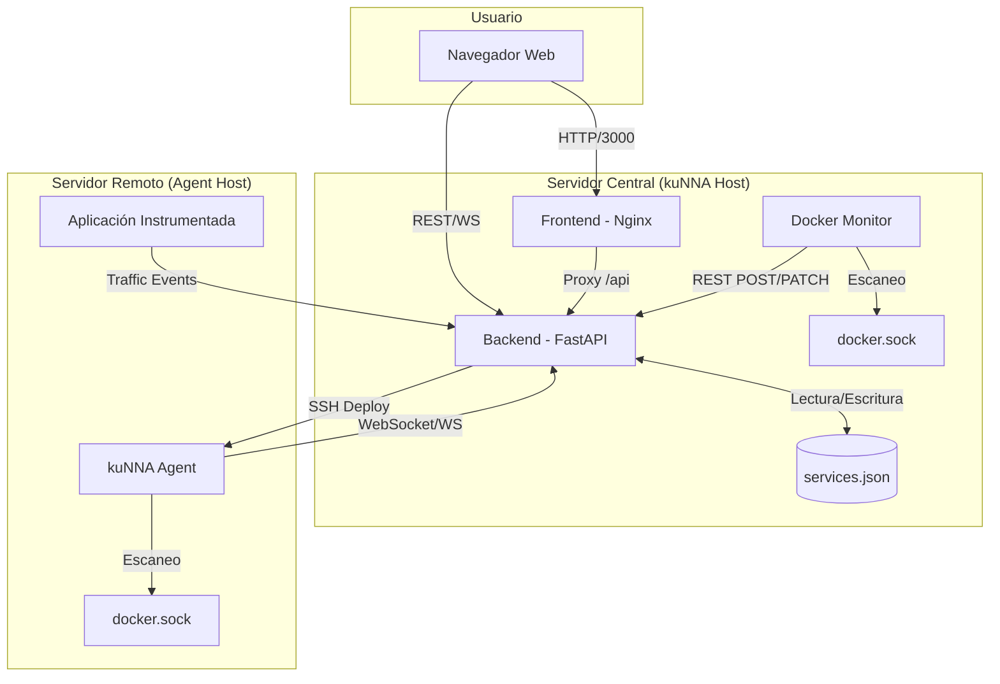
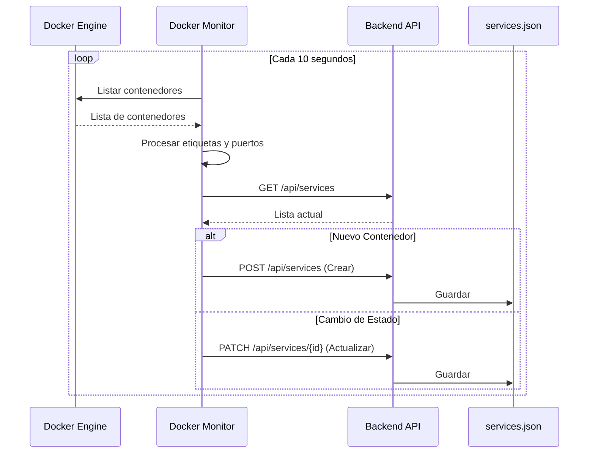
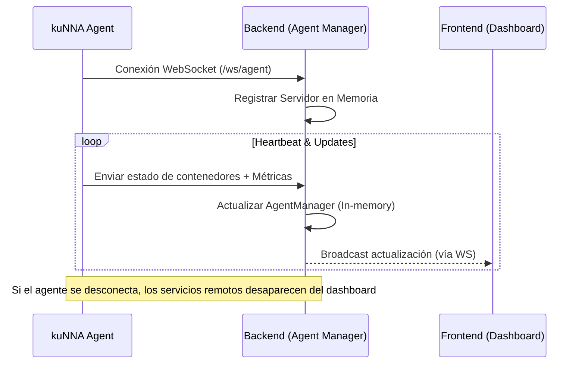
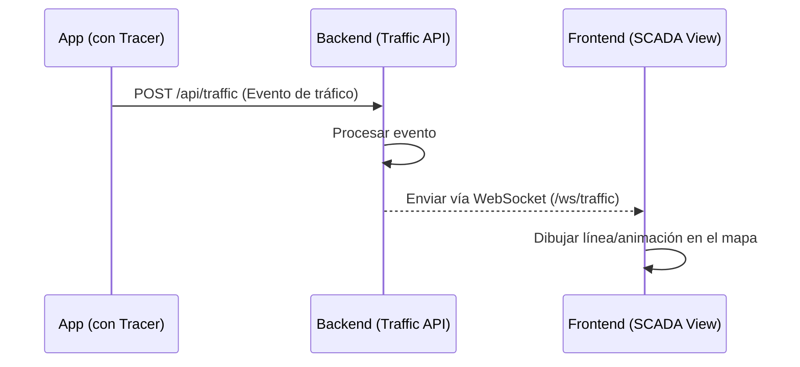
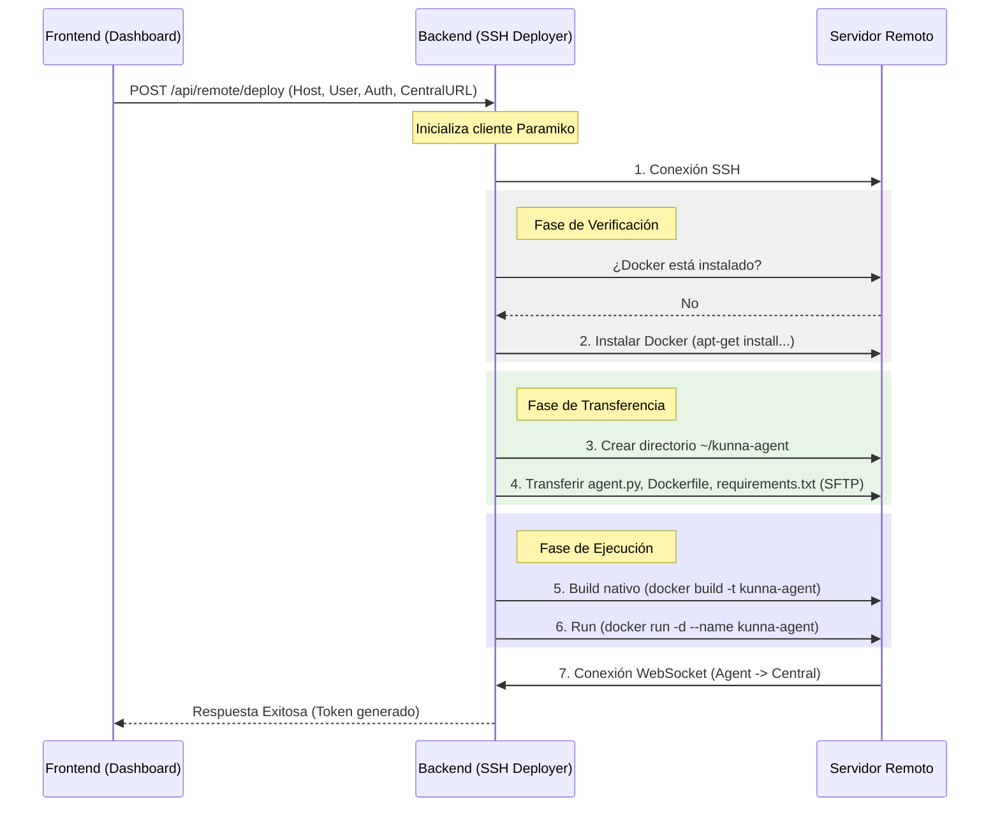

# Arquitectura y Funcionamiento de kuNNA 🎯

Este documento describe de manera técnica y visual cómo funciona kuNNA, sus componentes y los flujos de datos principales.

## 🏗️ Arquitectura de Alto Nivel

kuNNA utiliza una arquitectura distribuida basada en microservicios para el monitoreo y gestión de contenedores Docker, tanto locales como remotos.

---

## 🔍 Descubrimiento de Servicios

kuNNA descubre servicios de dos formas: localmente mediante un monitor dedicado y remotamente mediante agentes.

### 1. Descubrimiento Local (Docker Monitor)

El `docker-monitor` es un servicio independiente que observa el socket de Docker local y sincroniza el estado con el backend.

### 2. Descubrimiento Remoto (Agents)

Los agentes se conectan al servidor central mediante WebSockets, manteniendo una conexión persistente para reportar cambios en tiempo real.

---

## 📊 Monitoreo de Tráfico (SCADA)

El sistema SCADA visualiza el tráfico entre servicios en tiempo real.

---

## 🚀 Flujo de Despliegue de Agentes (SSH Deployment)

kuNNA permite expandir su red de monitoreo desplegando agentes en servidores nuevos directamente desde la interfaz. Este proceso automatiza la configuración del entorno y la ejecución del agente.

### 🔐 Credenciales y Seguridad
El sistema soporta dos métodos de autenticación para la conexión SSH:
- **Contraseña**: Autenticación tradicional por usuario/password.
- **Llave Privada (RSA/ED25519)**: Método recomendado para mayor seguridad.
- **Sudo**: El sistema detecta automáticamente si el usuario requiere privilegios de `sudo` para interactuar con Docker.

### 🔄 Proceso de Despliegue Paso a Paso

### 🛠️ Detalles Técnicos del Despliegue
1.  **Token de Seguridad**: El backend genera un `AGENT_TOKEN` único para cada despliegue, el cual se inyecta como variable de entorno en el contenedor del agente para autenticar la conexión WebSocket.
2.  **Detección de Arquitectura**: El agente se construye nativamente en el servidor remoto (`docker build`), lo que garantiza compatibilidad tanto con **AMD64** como con **ARM64** (ej: Raspberry Pi).
3.  **Aislamiento**: El agente corre dentro de un contenedor Docker, pero tiene acceso al socket del host (`/var/run/docker.sock`) para monitorear otros contenedores.
4.  **Persistencia**: Se configura para reiniciarse automáticamente (`--restart unless-stopped`).

---

## 💾 Modelo de Datos

### Servicio (Service)
Es la entidad principal que representa un enlace o contenedor.

| Campo | Tipo | Descripción |
|-------|------|-------------|
| `id` | String | Identificador único |
| `name` | String | Nombre del servicio |
| `url` | String | URL de acceso |
| `status` | String | `running`, `stopped`, `error` |
| `is_remote` | Boolean | Indica si viene de un agente |
| `app_group` | String | Agrupación para la topología |

### Evento de Tráfico (TrafficEvent)
Representa una comunicación entre dos puntos.

| Campo | Tipo | Descripción |
|-------|------|-------------|
| `from_service` | String | ID del origen |
| `to_service` | String | ID del destino |
| `method` | String | Método (GET, POST, etc) |
| `duration` | Float | Tiempo de respuesta en ms |

---

## 🛠️ Tecnologías Utilizadas

- **Frontend**: HTML5, CSS3 (Tailwind), JavaScript Vanilla, Mermaid.js (para diagramas dinámicos).
- **Backend**: Python 3.9+, FastAPI, Uvicorn.
- **Monitoreo**: Docker SDK para Python, Psutil.
- **Comunicación**: WebSockets (bidireccional), REST API.
- **Persistencia**: JSON File (Simple & Portable).
