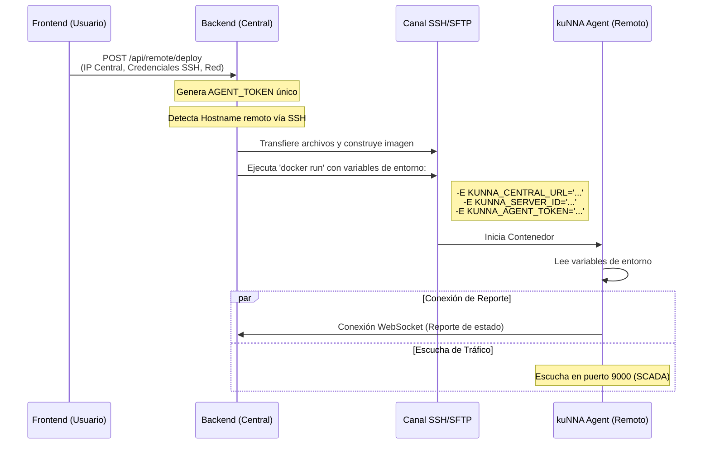
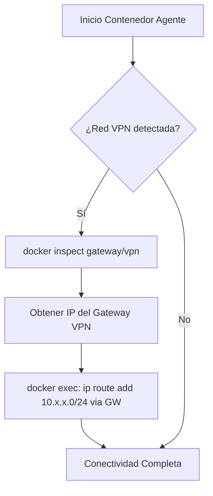
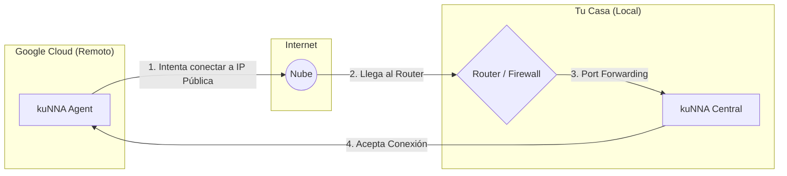

# Detalle Técnico: Despliegue SSH y Configuración de Red 🛠️

Este documento explica en profundidad cómo kuNNA configura automáticamente las direcciones IP, puertos y tokens durante el proceso de despliegue remoto.

## 🔄 Flujo de Configuración Dinámica

Cuando inicias un despliegue desde la interfaz, kuNNA realiza una "inyección de configuración" en el servidor remoto.



---

## 📋 Variables de Entorno Inyectadas

Durante el comando `docker run`, el backend inyecta las siguientes variables críticas:

| Variable | Origen | Propósito |
|----------|--------|-----------|
| `KUNNA_CENTRAL_URL` | Input del Usuario | URL (ws/http) del servidor central donde el agente debe reportar. |
| `KUNNA_AGENT_TOKEN` | Generado por BE | Token único para autenticar la conexión WebSocket del agente. |
| `KUNNA_SERVER_ID` | `hostname` remoto | Identificador único del servidor en el dashboard. |
| `KUNNA_TRAFFIC_PORT` | Hardcoded (9000) | Puerto donde el agente recibe eventos SCADA de apps locales. |

---

## 🛣️ Configuración de Red Avanzada (VPN/WireGuard)

Si el despliegue se realiza en una red específica (ej: `my_docker_network`), kuNNA aplica una lógica de ruteo adicional para garantizar la conectividad:

### 1. Aislamiento y Conectividad
El agente se une a la red Docker especificada mediante el flag `--network`. Esto le permite "ver" a otros contenedores en esa misma red privada.

### 2. Ruteo Inteligente
Si se detecta una red de tipo VPN, el sistema realiza los siguientes pasos automáticamente:



**Comando ejecutado internamente:**
```bash
docker exec kunna-agent ip route add 10.x.x.0/24 via [GATEWAY_IP]
```

---

## 🌐 Escenario: Monitoreo a través de Internet (Sin VPN)

Este es el escenario que planteas: Tu **PC en casa** (detrás de un router) y un **Servidor en Google Cloud**.

### El Problema: El Muro del Router (NAT)
Tu servidor en Google Cloud no puede "ver" tu PC de casa directamente porque tu router bloquea las conexiones entrantes por seguridad.

### La Solución: "Llamada a Casa" (Reverse Connection)
kuNNA está diseñado para que el **Agente sea quien inicie la conexión**. Sin embargo, para que esto funcione, tu PC de casa debe ser "visible" en Internet.



### 🛠️ ¿Cómo configurarlo en la vida real?

Tienes dos opciones principales para que el servidor de Google encuentre tu casa:

#### Opción A: Port Forwarding (Tradicional)
1.  **En tu Router**: Configura una regla de "Port Forwarding" para que todo lo que llegue al puerto `8000` (API) y `3000` (Frontend) se redirija a la IP local de tu PC.
2.  **IP Pública**: Debes conocer tu IP pública (ej: `201.150.x.x`).
3.  **En kuNNA**: Al desplegar el agente, en `Central URL` pones: `ws://tu-ip-publica:8000`.

#### Opción B: Túneles (Recomendado / Más Seguro)
Si no quieres abrir puertos en tu router, puedes usar herramientas como **Cloudflare Tunnels** o **ngrok**.
1.  Instalas el túnel en tu PC de casa.
2.  Te darán una URL como `https://kunna-home.pagedemo.net`.
3.  **En kuNNA**: Al desplegar el agente, en `Central URL` pones: `wss://kunna-home.pagedemo.net`.

---

## 💡 Ejemplos Prácticos de Configuración

### Ejemplo 1: Red Local (Casa)
*   **PC Casa**: `192.168.x.50`
*   **Raspberry Pi**: `192.168.x.100`
*   **Central URL**: `ws://192.168.x.50:8000`
*   **App en Raspberry**: Reporta a `http://localhost:9000`

### Ejemplo 2: Servidor en Google Cloud (Vía Internet)
*   **PC Casa (IP Pública)**: `187.20.30.40`
*   **Servidor Google**: `34.120.x.x`
*   **Central URL**: `ws://187.20.30.40:8000` (Requiere Port Forwarding en el router de casa)
*   **App en Google**: Reporta a `http://localhost:9000` (El agente local en Google recibe el tráfico y lo reenvía a tu casa por el túnel que él mismo abrió).

---

## 🔐 Seguridad en el Despliegue

1.  **Tokens Efímeros**: Cada despliegue genera un token único. Si un agente es comprometido, no afecta a los demás.
2.  **Socket de Docker**: El agente accede al socket de Docker en modo **Solo Lectura** (`:ro`) siempre que es posible, minimizando riesgos.
3.  **SSH**: Las credenciales (passwords/keys) solo existen en memoria durante el proceso de despliegue y no se almacenan en la base de datos de servicios.

---

Para más detalles sobre la arquitectura general, consulta [ARCHITECTURE.md](ARCHITECTURE.md).
